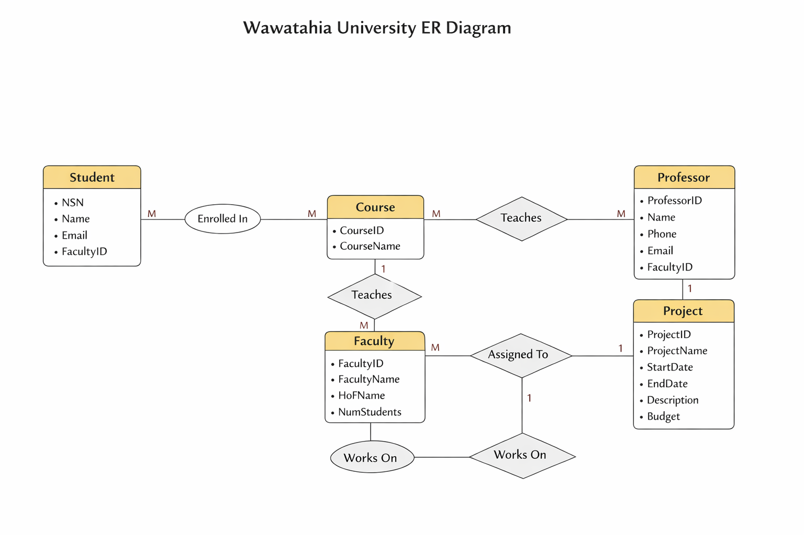

# Wawatahia University Database Project

A Level 5 database design and management project for a fictional university system. The project demonstrates database planning, normalisation, entity relationship modelling, SQL implementation, testing, database administration, backup and recovery, and documentation.

> **Student portfolio project** completed as part of the NZ Diploma / Certificate in Information Technology pathway.

## Project Overview

Wawatahia University required a structured database to manage core academic information, including students, professors, faculties, courses, projects, enrolments, teaching assignments, and project supervision.

The goal of this project was to design and document a relational database that reduces data duplication, improves data integrity, and supports efficient retrieval of academic records.

## Skills Demonstrated

- Relational database design
- Entity Relationship Diagram (ERD) creation
- Database normalisation to Third Normal Form (3NF)
- SQL table creation and data manipulation
- User roles and access permissions
- Database testing and debugging
- Backup and recovery planning
- Technical documentation
- Structured project presentation

## Technologies Used

- SQL / MySQL concepts
- Database normalisation
- ERD modelling
- Draw.io
- Microsoft Excel
- Technical report writing

## Database Scope

Main entities include:

- Faculty
- Student
- Professor
- Course
- Project
- Enrollment
- Teaching
- StudentProject

Key relationships include:

- Students enrolling in courses
- Professors teaching courses
- Students working on projects
- Professors assessing projects
- Faculties containing students, professors, and courses

## Repository Structure

```text
wawatahia-university-database/
├── README.md
├── docs/
│   ├── Wawatahia_Database_Assignment.pdf
│   ├── DDM512_Assessment_Part_1_Deacon_George.pdf
│   ├── DDM512_Assessment_Part_2_Deacon_George.pdf
│   └── DDM512_Assessment_Checklist_Signed.pdf
├── diagrams/
│   ├── erd.png
│   ├── wud-erd.jpg
│   └── wud-erd.drawio
├── normalisation/
│   ├── 1nf.png
│   ├── 2nf.png
│   ├── 3nf.png
│   └── normalisation-1nf-3nf.xlsx
└── screenshots/
    └── database-implementation/
```

## ERD



## Normalisation

The database design was normalised through:

- First Normal Form (1NF)
- Second Normal Form (2NF)
- Third Normal Form (3NF)

Supporting normalisation files are included in the `normalisation/` folder.

## Documentation

The full project documentation is included in the `docs/` folder. These documents show the planning, design, implementation, testing, administration, backup, recovery, and ethical considerations for the database.

## What I Learned

This project strengthened my understanding of how databases are planned before implementation. It helped me understand the importance of normalisation, clear documentation, relationship design, user permissions, testing, and backup planning.

It also reinforced one of my main strengths: building organised systems that make information easier to manage and retrieve.

## Future Improvements

If continuing this project, I would add:

- A full SQL schema export
- Sample data scripts
- Query examples
- A simple web interface
- A dashboard for student, course, and project reporting

## Author

**Deacon George**  
Tauranga, New Zealand  
GitHub: [deacongeorgenz](https://github.com/deacongeorgenz)
